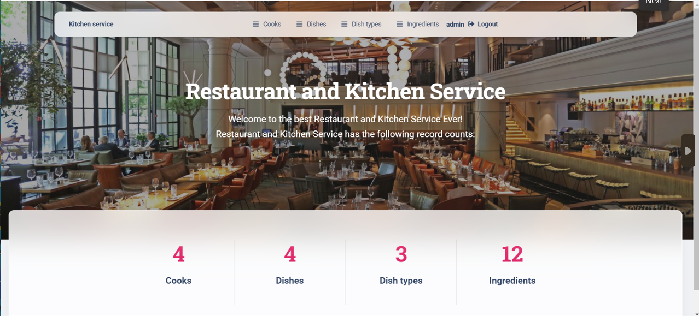

# Restaurant and Kitchen service

A powerful tool to improve the communication & rules between cooks on the kitchen.
This service is represented a management system, in which Cooks can create new Dishes & Dishtypes, and also specify, Cooks which are responsible for every Dishes cooking.


## Try it out

Task Manager project deployed to Render -
* https://kitchen-service-isgn.onrender.com/

Use the following user to log in and check the functionality of the website: 

```shell
login: testuser1
password: passforfirstuser
```

## Features

* Authentication for Cook/User
* Managing cooks, dishes, dish types and ingredients directly from the website interface
* custom admin panel

## Demo




## Installation 

Python3 must be already installed

```shell
git clone https://github.com/MarynaProkhorenko/restaurant_kitchen_service
cd restaurant_kitchen_service
python3 -m venv venv
source venv/bin/activate  # on macOS
venv\Scripts\activate  # on Windows 
python manage.py migrate
python manage.py runserver #starts Django Server
```

<br />